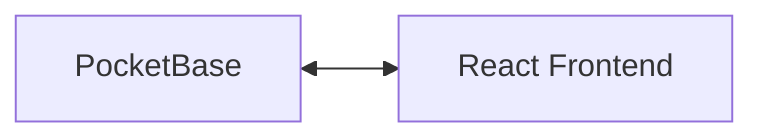

# UIUC Marketplace

The [UIUC Marketplace](https://uiuc-marketplace.vercel.app/) is a web application that allows UIUC students to buy and sell items with other students. The application allows users to create an account, post items for sale, and view items for sale. The application also allows users to search for items by category and price as well letting users chat with each other to negotiate prices and arrange meetups. The application was built using React, Typescript and PocketBase as well as TailwindCSS and shadcn for the UI.

## Technical Architecture



## Environment Overview and Setup

The PocketBase API is hosted on PocketHost and the React frontend is hosted on Vercel. The application can be accessed at [UIUC Marketplace](https://uiuc-marketplace.vercel.app/) and the database/API can be accessed at [PocketBase](https://uiuc-marketplace.pockethost.io/_) but requires login credentials which can be issued by current developers. The web app can also be run locally by cloning the repository and running the following commands:

```bash
npm install

npm run dev
```

## Developers

- **Yash Savalia**: Managed database/api, and implemented frontend.
